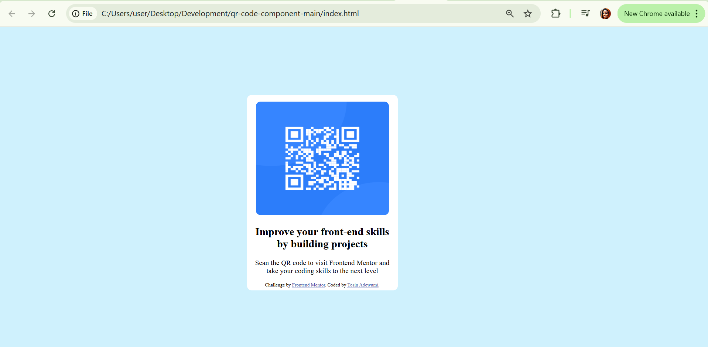

# Frontend Mentor - QR code component solution

This is a solution to the [QR code component challenge on Frontend Mentor](https://www.frontendmentor.io/challenges/qr-code-component-iux_sIO_H). Frontend Mentor challenges help you improve your coding skills by building realistic projects.

## Table of contents

- [Overview](#overview)
  - [Screenshot](#screenshot)
  - [Links](#links)
- [My process](#my-process)
  - [Built with](#built-with)
  - [What I learned](#what-i-learned)
  - [Continued development](#continued-development)
  - [Useful resources](#useful-resources)
- [Author](#author)

**Note: Delete this note and update the table of contents based on what sections you keep.**

## Overview

### Screenshot



### Links

- Solution URL: [Add solution URL here](https://github.com/tadewumi2/qrCodeFrontendMentor)
- Live Site URL: [Add live site URL here](https://tadewumi2.github.io/qrCodeFrontendMentor/)

## My process

### Built with

- Semantic HTML5 markup
- CSS custom properties
- Relative/Absolute position
- Transform
  Since it's a static layout, I didn't bother coding for any specific screen type.

### What I learned

Eventhough I have a rough idea about relative/absolute position, it is great to actually use it in a project.

```css
body {
  position: relative;
}

#container {
  position: absolute;
  top: 50%;
  left: 50%;
  transform: translate(-50%, -50%);
}
```

### Continued development

I will like to practice the 'position' and 'transform' property more.

### Useful resources

Initially, I could not grasp the conceptof having a QR code 'image' that is not exactly 'doing anything'. Youtube, stack overflow and google were quite helpful.

## Author

- Website - [Tosin Adewumi](https://tadewumi2.github.io/tosinadewumi/)
- Frontend Mentor - [@yourusername](https://www.frontendmentor.io/profile/tadewumi2)
